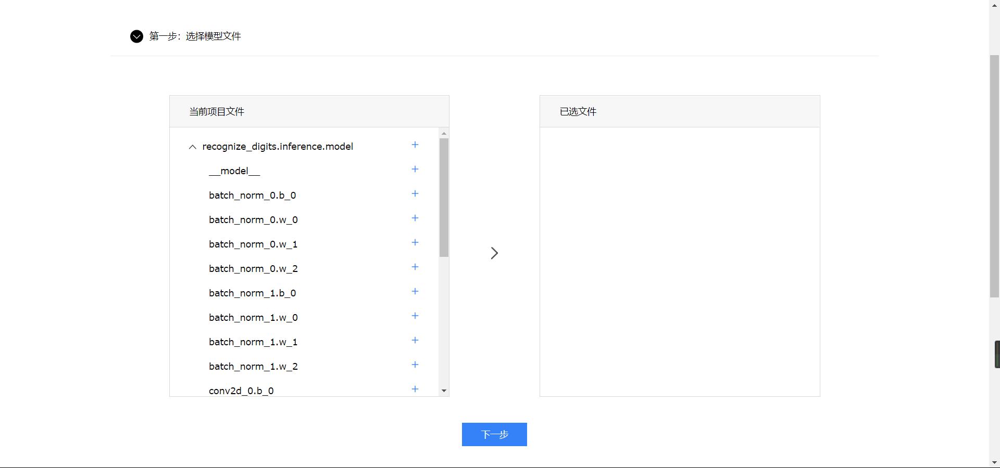
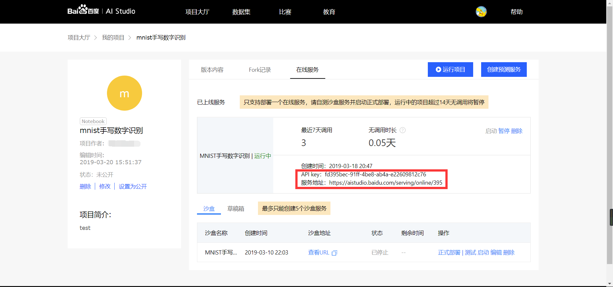

# MNIST数字识别-在线部署
## 教程说明
本教程主要是使用AI Studio部署数字识别模型，模型的训练使用了[PaddlePaddle的数字识别教程](http://paddlepaddle.org/documentation/docs/zh/1.2/beginners_guide/quick_start/recognize_digits/README.cn.html)，AI Studio的使用参考了[AI Studio的教程——项目大厅-在线部署及预测](http://ai.baidu.com/docs#/AIStudio_Project_Forecast/top)，AI Studio Notebook的使用参考教程[项目大厅-Notebook使用说明](http://ai.baidu.com/docs#/AIStudio_Project_Notebook/top)
<br>

## 创建项目
打开[AI Studio](https://aistudio.baidu.com/aistudio/#/projectoverview)并登陆 （不支持IE浏览器）    
  
然后打开[MNIST数字识别（引用数据集）](https://aistudio.baidu.com/aistudio/#/projectdetail/46183)  
点击【fork】  
  

输入【项目名称】和【项目描述】，然后点击【创建】  
  

创建完成后，点击【运行项目】  


## 通过训练任务生成模型文件

点击【Notebook操作】，然后点击【运行所有】，程序便开始运行，大约需要十分钟（5000pass），请耐心等待    
  

最后一个训练的cell打印信息时会卡住  
  
（此步可忽略：点击“最后一个cell”的【清空输出】后将会打印新的信息，但仍会卡住，可以不管它）  
  
等到最后一个cell右下角出现绿色的【运行耗时：xx】时，说明训练结束  
 


结束后在左侧【文件夹】中会看到生成的模型文件（若没有可以尝试点击【刷新】）  
  

## 创建在线预测服务
完成模型训练后, 在**单机项目页面**点击【创建预测服务】  


### 第一步 选择模型文件
点击recognize_digits.inference.model左侧的箭头展开模型文件  
  

点击recognize_digits.inference.model右侧的“+”选择该文件夹下的所有文件  

  
  
### 第二步 确认输入输出
记住这里的输入变量名，同时输入参数类型选择【图像Base64】  
   
输出参数类型为【字符串】  
  
  
### 第三步 制作参数转换器
选择【自定义转换器】   

输入参数  
这里的变量`img`要和第二步输入参数设置的参数名相同  
对`image`的操作是将它变成一个 numpy 数组以匹配数据feed格式
```
# -*- coding: utf-8 -*-
"""
Hook
"""
import os
import sys

sys.path.append("..")
from PIL import Image
import numpy as np
import paddle.fluid as fluid

from home.utility import base64_to_image


def reader_infer(data_args):
    """
    reader_infer
    :param data_args: 接口传入的数据，以k-v形式
    :return [[]], feeder
    """

    def reader():
        """
        reader
        :return:
        """
        img = fluid.layers.data(name='img', shape=[1,28,28], dtype='float32')
        feeder = fluid.DataFeeder(place=fluid.CPUPlace(), feed_list=[img])
        image = base64_to_image(data_args["img"])
        image = image.convert("L")
        image = image.resize((28, 28), Image.ANTIALIAS)
        image = np.array(image).reshape(1, 1, 28, 28).astype(np.float32)
        image = image / 255.0 * 2.0 - 1.0
        return [[image]], feeder
        
    return reader

```


输出参数
```
# -*- coding: utf-8 -*-
"""
Hook
"""
import numpy as np

def output(results, data_args):
    """
    模型识别结果是各数字的概率
    使用numpy的argmax方法选出概率最大的作为识别结果
    :param results 模型预测结果
    :param data_args: 接口传入的数据，以k-v形式
    :return predict 需要能被json_encode的数据格式
    """
    result = np.argmax(results)
    predict = {'predict':result}
    return predict
```  

### 第四步 沙盒部署
输入名称，点击【生成沙盒】  
  

## 测试沙盒服务
### 第一步 点击【测试】进入测试页面


### 第二步 将测试图片转为BASE64格式
打开[https://www.base64-image.de/](https://www.base64-image.de/)，将测试图片拖入指定区域转换格式  
  
转换成功后点击【copy image】复制转换后的代码  
  

### 第三步 填写json格式请求参数
使用刚才复制的图片代码替换`img`的`value`  
 
  
### 第四步 点击【发送请求】校验返回结果
点击后片刻便会看到【请求结果】和【请求日志】  
  
如果【请求结果】中为错误信息，可在【请求日志】中查看更具体的报错，之后点击最下方的【进入编辑页面】对之前的预测服务进行修改即可。  

## 部署在线服务
点击【返回沙盒列表】后，点击沙盒后的【正式部署】即可部署线上API  


## 调用在线服务  
依据API key、服务地址和用户自定义参数, 实现对服务的调用

**请求URL在Android调用API中会使用**  
### 请求方式
* HTTP请求URL: [服务地址] [?] [apiKey=xxx]  
* HTTP请求方法: POST  
* HTTP Body: 用户自定义参数  
    
