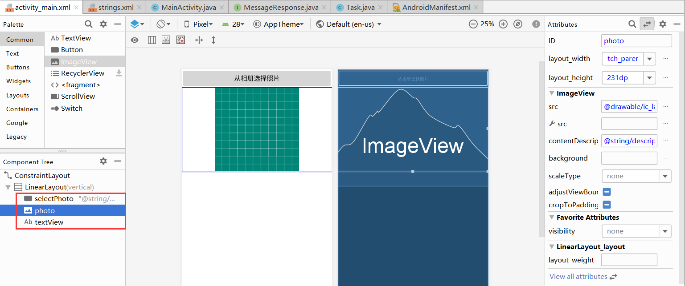
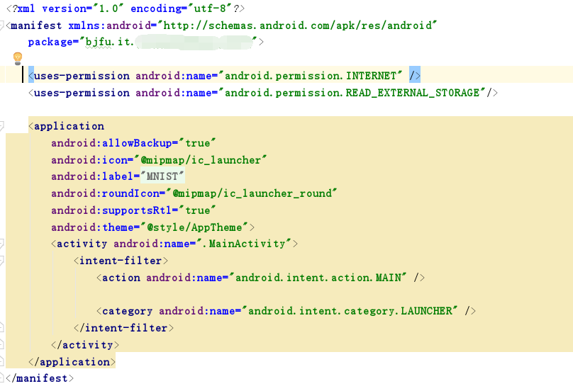
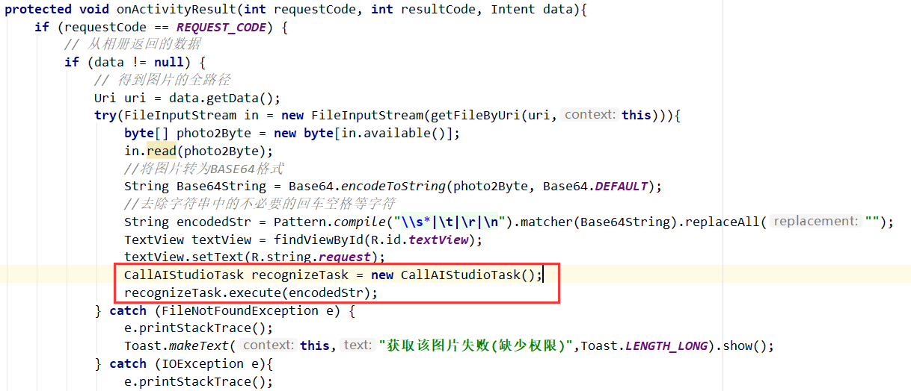
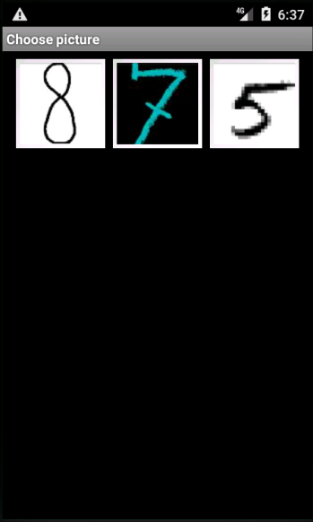

# 2. Andorid应用调用AI Studio云识别服务
## 第一步 创建虚拟Android虚拟机
* 虚拟机的系统版本要求**大于4.4、小于6.0**，即API Level为**19~22**  
本文以API Level 22为例   
* 当系统版本大于6.0时，需额外添加权限  

启动虚拟机后，直接向相册【Gallery】中拖入一张数字照片（1位数）做为准备(也可从网上找)   
**注**：上传过程很慢，图片拖进去后不会马上显示，**不要**因为着急重复将图片拖入，**等待片刻后按住虚拟机右侧列表的关机键**关机，重新打开虚拟机后再查看相册，若仍没有则重复此步骤。

## 第二步 创建工程
先创建一个新的工程，之后在`activity_main.xml`中拖入线性布局，之后拖入1个【Button】、1个【ImageView】以及一个【TextView】，控件ID如图所示（可根据个人喜好调整布局，这里以最简单的为例）  
【Button】的onClick事件改为onClickButton  
  

`string.xml`中添加如下代码以便后续使用：
```
<string name="selectPhoto">从相册选择照片</string>
<string name="takePhoto">拍摄照片</string>
<string name="description">图片</string>

<string name="request">请求中......</string>
<string name="errorUploadFailed">图片上传失败</string>
<string name="errorUrlWrong">URL错误</string>
<string name="errorConnectFailed">建立连接失败</string>
<string name="errorRequestFailed">服务调用失败（建议到AI Studio确认服务器状态）</string>
<string name="errorAPINotRunning">AI Studio部署的服务不是运行中状态，请先启动服务</string>
```

## 第三步 添加权限
打开`AndoridManifest.xml`，在`<application>`标签**上面**添加两行代码
分别授予应用访问网络和访问外部存储的权限（图片存储在外存上）
```
<uses-permission android:name="android.permission.INTERNET" />
<uses-permission android:name="android.permission.READ_EXTERNAL_STORAGE"/>
```  
   

## 第四步 编写代码
调用API识别图像主要过程为以下2步：  
1.打开相册，选择图片并获得图片的URI（Universal Resource Identifier）  
2.通过异步任务上传图片调用AI Studio云识别服务，获得识别结果  

### 1.获取图片的URI
首先声明常量`REQUEST_CODE`用于异步任务  
```
public static final int REQUEST_CODE = 2;
```

之后在MainActivity中创建点击按钮事件，用于打开相册并选择图片  
```
public void onClickButton(View view) {
    Intent intent = new Intent(Intent.ACTION_PICK);
    intent.setDataAndType(MediaStore.Images.Media.EXTERNAL_CONTENT_URI, "image/*");
    startActivityForResult(intent, REQUEST_CODE);
}
```  

因为打开相册实际是跳转到其他`Activity`，所以这里使用`Intent`：   
`new Intent(Intent.ACTION_PICK)`和`intent.setDataAndType`是创建一个用于获取数据的`intent`  
`setDataAndType(MediaStore.Images.Media.EXTERNAL_CONTENT_URI,"image/*")`是设置`intent`的数据为外存URI，类型为图像  
具体可查看[Intent的API](https://developer.android.com/reference/android/content/Intent)  

相册是另一个`Activity`，所以不能直接把图片传给`MainActivity`，这需要使用  
`public void startActivityForResult (Intent intent, int requestCode)`和`onActivityResult（int requestCode, int resultCode, Intent data）`方法来接收图片。  
接收图片的代码如下（在`onCreate`方法外）：  
```
protected void onActivityResult(int requestCode, int resultCode, Intent data){
    if (requestCode == REQUEST_CODE) {
        // 从相册返回的数据
        if (data != null) {
            // 得到图片的全路径
            Uri uri = data.getData();
            try(FileInputStream in = new FileInputStream(getFileByUri(uri,this))){
                byte[] photo2Byte = new byte[in.available()];
                in.read(photo2Byte);
                //将图片转为BASE64格式
                String Base64String = Base64.encodeToString(photo2Byte, Base64.DEFAULT);
                //去除字符串中的不必要的回车空格等字符                    String encodedStr = Pattern.compile("\\s*|\t|\r|\n").matcher(Base64String).replaceAll("");
                TextView textView = findViewById(R.id.textView);
                textView.setText(R.string.request);
            } catch (FileNotFoundException e) {
                e.printStackTrace();
                Toast.makeText(this,"获取该图片失败(缺少权限)",Toast.LENGTH_LONG).show();
            } catch (IOException e){
                e.printStackTrace();
                Toast.makeText(this,"图片读取失败",Toast.LENGTH_LONG).show();
            }

            ImageView photo = findViewById(R.id.photo);
            photo.setImageURI(uri);
        }
    }
}   


public File getFileByUri(Uri uri, Context context) {
    String path = null;
    String[] projection = { MediaStore.Images.Media.DATA };
    Cursor cursor = context.getContentResolver().query(uri, projection, null, null, null);
    if (cursor!=null && cursor.moveToFirst()) {
        int columnIndex = cursor.getColumnIndexOrThrow(MediaStore.Images.Media.DATA);
        path = cursor.getString(columnIndex);
        cursor.close();
    }
    if(path!=null)
        return new File(path);
    else
        return null;
}

```
说明：
* `startActivityForResult`的第一个参数`intent`用于携带数据跳转，第二个参数`requestCode` >= 0 时用于与`onActivityResult`的第一个参数`requestCode`相对应，以便确定数据是从哪个`Activity`传来的。  
* `onActivityResult`的第二个参数`resultCode`是结果代码，可用于标识成功、错误等结果，第三个参数`data`则是携带数据的intent   
[官方文档](https://developer.android.com/training/basics/intents/result)  
<br>

### 2.使用异步任务上传图片调用API
在Android4.0后，主线程不再允许发起网络请求（因为网络请求有可能有延迟,丢失的情况，容易卡住阻塞主进程），所以这里使用异步任务上传图片。  

**注意：代码中的URL要换成自己在AI Studio部署模型的URL**  

**在MainActivity中创建一个内部类CallAIStudioTask用于完成异步任务**：实现`AsyncTask<Params, Progress, Result>`接口（`Params`表示传入参数类型，`Progress`表示处理参数类型，`Result`表示返回类型接口），同时还需要重写`doInBackground(String... params)`和`onPostExecute(String result)`方法来实现异步  
* 当`doInBackground`方法执行完毕后，会把结果传入`onPostExecute`方法  
<br>

具体代码如下：  
```
class CallAIStudioTask extends AsyncTask<String,Void,String> {
    @Override
    protected String doInBackground(String... params) {
        String result = "";
        //构造JSON键值对（变量名要和AI Studio部署模型的输入参数相同）
        TextView textView = findViewById(R.id.textView);
        try {
            String json = "{\"img\":\"" + params[0] + "\"}";
            byte[] data = json.getBytes(StandardCharsets.UTF_8);
            //部署AI Studio后根据 [服务地址] [?] [apiKey=xxx]生成URL
            URL url = new URL("xxx?apiKey=xxx");
            HttpURLConnection connection = (HttpURLConnection) url.openConnection();
            connection.setConnectTimeout(3000);
            connection.setDoInput(true);//表示从服务器获取数据
            connection.setDoOutput(true);//表示向服务器写数据

            connection.setRequestMethod("POST");
            //是否使用缓存
            connection.setUseCaches(false);
            //表示设置请求体的类型是文本类型
            connection.setRequestProperty("Content-Type", "application/x-javascript; charset=UTF-8");
            connection.setRequestProperty("Content-Length", String.valueOf(data.length));

            try(OutputStream out = connection.getOutputStream()) {
                out.write(data);
                out.flush();
                InputStream in= connection.getInputStream();
                // 响应代码 200表示成功
                Log.d("响应代码",String.valueOf(connection.getResponseCode()));
                if (connection.getResponseCode() == 200) {
                    result = new String(toByteArray(in), StandardCharsets.UTF_8);
                    Log.d("result",result);
                }
            }catch (IOException e){
                e.printStackTrace();
                Log.d("错误信息","图片上传失败");
                textView.setText(R.string.errorUploadFailed);
            }

        }catch (MalformedURLException e) {
            e.printStackTrace();
            Log.d("错误信息","URL错误");
            textView.setText(R.string.errorUrlWrong);
        }catch (IOException e){
            e.printStackTrace();
            Log.d("错误信息","建立连接失败");
            textView.setText(R.string.errorConnectFailed);
        }
        return result;
    }


    private byte[] toByteArray(InputStream input) throws IOException {
        ByteArrayOutputStream output = new ByteArrayOutputStream();
        byte[] buffer = new byte[4096];
        int n = input.read(buffer);
        if (n != -1) {
            output.write(buffer, 0, n);
        }
        return output.toByteArray();
    }

    @Override
    protected void onPostExecute(String response) {
        //参数response是方法“doInBackground()”的返回值
        TextView textView = findViewById(R.id.textView);
        if(response.contains("服务调用失败"))
            textView.setText(R.string.errorRequestFailed);
        else if(response.contains("不是运行中状态"))
            textView.setText(R.string.errorAPINotRunning);
        else {
            StringBuffer result = new StringBuffer();
            String splitedResult[] = response.split("[{}:]");
            result.append("识别结果：").append(splitedResult[splitedResult.length - 1]);
            textView.setText(result);
        }
    }
}

```
创建了用于异步任务的内部类`CallAIStudioTask`后，在之前的`onActivityResult`方法中`try`的最后，添加两行代码使用：  
```
CallAIStudioTask recognizeTask = new CallAIStudioTask();
recognizeTask.execute(encodedStr);
```  

<br>


## 运行APP
运行app，并从相册中选择一张数字的图片，即可调用自己部署的模型的API，看到预测的结果  
* 运行app  
  
* 选择图片  

* 查看识别结果    
  